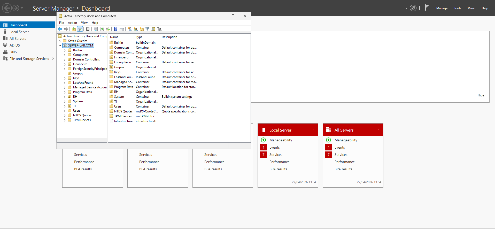

# 🧠 Active Directory Basic Lab

Projeto prático de Active Directory simulando um ambiente corporativo básico.

---

## 🎯 Objetivo
Demonstrar conhecimentos em administração de Active Directory, incluindo estrutura organizacional, segurança e backup.

---

## 🏢 Estrutura do Ambiente

- Domínio: `server-lab.com`
- VirtualBox
- Windows Server (Controlador de Domínio)
- Windows 10 (Cliente)

---

## 🧱 Organizational Units (OU)

Criação de OUs para organização dos setores:

- TI
- RH
- Financeiro

---

## 👤 Usuários

Usuários criados para simulação de ambiente corporativo:

- Maria Souza
- João

---

## 👥 Grupos

Grupos de segurança criados:

- RH_users
- TI_users

---

## 🔐 GPO (Políticas de Segurança)

Configurações aplicadas:

- Mínimo de 7 caracteres
- Complexidade de senha habilitada

---

## 💾 Backup

Backup configurado utilizando **System State**:

---

## ♻️ Lixeira do Active Directory

Teste de exclusão e recuperação de usuários:

---

## 🧠 Aprendizados

- Estruturação de Active Directory
- Gerenciamento de usuários e grupos
- Aplicação de GPO
- Configuração de backup no Windows Server
- Recuperação de objetos no AD

---
